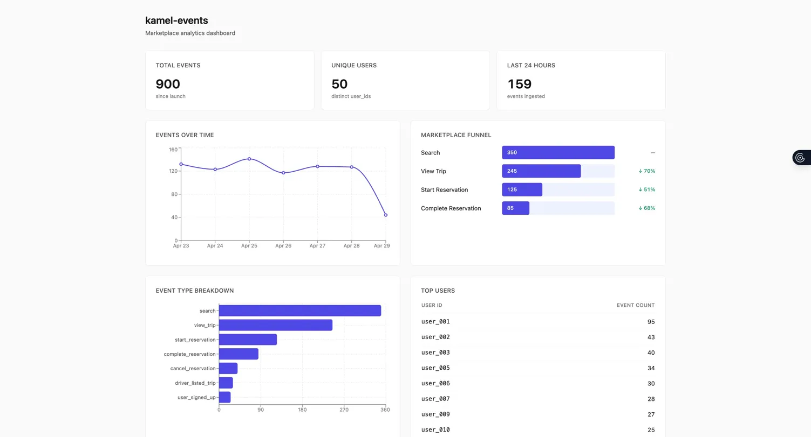
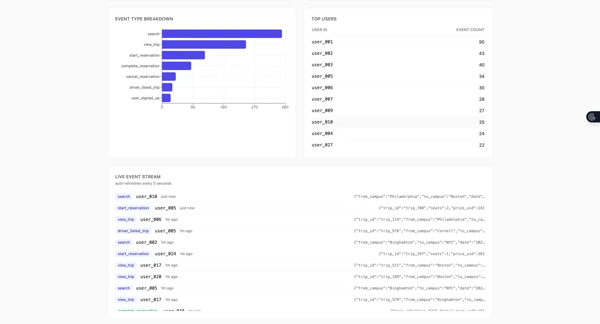

# kamel-events

Take-home assignment for Kamel Ride. A TypeScript system that collects
events and renders marketplace analytics in a dashboard.

Built April 28–30, 2026 by Shadi Al Azzeh.



## Run in 60 seconds

Requirements: Node 20+ and a Unix-like shell.

```bash
git clone https://github.com/shadiazzeh11/kamel-events
cd kamel-events
npm run install:all      # installs root, server, and client deps
npm run --prefix server seed   # populates ~900 events of seed data
npm run dev                    # starts both server (4000) and client (5173)
```

Then open http://localhost:5173.

To exercise the live event stream, POST an event in another terminal:

```bash
curl -X POST http://localhost:4000/events \
  -H "Content-Type: application/json" \
  -d '{"event_type":"complete_reservation","user_id":"user_001","properties":{"trip_id":"demo","total_paid_usd":42}}'
```

Within 5 seconds the new event appears at the top of the live stream
and the totals tick up.

## What's in the box

**Backend** (`/server`) — Node + Express + TypeScript + better-sqlite3 + Zod
- `POST /events` — accepts arbitrary events, validates with Zod
- `GET /events?limit=N` — recent events for the live stream
- `GET /analytics/overview` — totals, events-over-time, type breakdown
- `GET /analytics/funnel` — conversion rates through the marketplace funnel
- `GET /analytics/users` — top 10 users by event count
- `GET /health` — `{ ok: true, event_count: N }` for sanity checks
- One Vitest unit test on the funnel calculation, including the
  divide-by-zero edge case

**Frontend** (`/client`) — Vite + React + TypeScript + Tailwind + Recharts
- Header strip with three big-number cards
- Events-over-time line chart (last 7 days, gap-filled)
- Marketplace funnel as horizontal bars with conversion percentages
- Event type breakdown bar chart
- Top users table
- Live event stream that polls every 5 seconds

**Shared** (`/shared/types.ts`) — one TypeScript file with the `Event`
type and analytics response shapes. Imported by both server and client
via relative path. Changing the schema is caught at compile time on
both sides.



## Architecture decisions and tradeoffs

### Why a generic event system seeded with marketplace data

The prompt is generic ("collects events"), but a generic dashboard
without context is forgettable. I built a generic event collection
system but seeded it with realistic marketplace events
(`search → view_trip → start_reservation → complete_reservation`,
plus driver-side and account events) and built the funnel
visualization around the questions a marketplace founder actually
asks. The backend accepts any `event_type` string — the marketplace
events are conventions in seed data, not constraints in code.

### Why SQLite via better-sqlite3

Zero ops. The database is a file in the project's working tree, no
Docker, no daemon, no migration tool. better-sqlite3 specifically
because its synchronous API is faster than async wrappers at this
scale and avoids a class of callback bugs. The tradeoff: this won't
scale past one process. For a take-home that's the right call; for
production, the swap to Postgres is one module file (`db.ts`) and
identical helper signatures.

### Why polling, not websockets

The dashboard is read by humans glancing at it. Five-second latency
is imperceptible. Polling is one fewer moving part — no socket
lifecycle, no reconnect logic, no broadcast bookkeeping. The polling
loop is also defensive: errors are logged at warn level and silently
retried so a transient network blip doesn't blank a working
dashboard.

### Why a monorepo with relative imports rather than workspaces

The shared `Event` type lives in `/shared/types.ts` and is imported
by both apps via `../../shared/types`. This works in both Vite (via
its bundler resolver) and tsx (via NodeNext at runtime) without any
workspace configuration, path aliases, or build orchestration. The
build wiring isn't the signal; the type being imported in both
places is. Less config, fewer things to break.

### Why pure functions for analytics

`calculateFunnel` lives in `analytics.ts` and takes `Event[]` and
`string[]` as input, returns plain objects. No database access, no
Express, no `Date.now()`. This is what the unit tests import. If the
funnel math broke, the test failures would point at the math
directly rather than at a database setup issue. Aggregations that
are cheaper in SQL (events-by-day, by-type, top users) live in
`db.ts` and are documented as such.

### Why the funnel is hand-rolled bars instead of Recharts' FunnelChart

Recharts' built-in funnel component is quirky and resists styling.
Four horizontal bars with widths proportional to count and
conversion percentages computed inline gave us full control of the
visual register in less code. Cleaner, faster, and I had full
control over the bar widths and label placement.

### Why Tailwind v3, not v4

Tailwind v4 changed setup materially in late 2024. Pinning v3.4 with
the well-documented `init -p` flow avoided wrestling with config at
4 AM. The dashboard uses a deliberately small palette: neutral grays
plus one indigo accent, with emerald and rose reserved for semantic
event-type badges (completed/cancelled). No gradients, no shadows
beyond `shadow-sm`, no decorative elements. Restraint reads as
design judgment.

### Why end-to-end TypeScript with shared types

`Event`, `OverviewResponse`, `FunnelResponse`, `TopUsersResponse`,
and `HealthResponse` are defined once in `/shared/types.ts`. The
server enforces them at the API boundary (via Zod for inputs, type
annotations for outputs); the client consumes them via the typed
fetch wrappers in `client/src/api.ts`. Adding a field to `Event`
fails the build in both apps until both are updated. Zero `any`
in the codebase.

## Project structure

```
kamel-events/
├── server/
│   ├── src/
│   │   ├── index.ts             # Express app, route mounting, error middleware
│   │   ├── db.ts                # SQLite connection, schema, prepared statements
│   │   ├── analytics.ts         # Pure funnel calculation
│   │   ├── analytics.test.ts    # Vitest tests
│   │   ├── seed.ts              # Idempotent seed script
│   │   └── routes/
│   │       ├── events.ts        # POST + GET events
│   │       └── analytics.ts     # /health, /overview, /funnel, /users
│   └── data.db                  # SQLite file (gitignored)
├── client/
│   └── src/
│       ├── App.tsx              # Layout + data fetching + polling
│       ├── api.ts               # Typed fetch wrappers, /api proxy prefix
│       ├── format.ts            # formatCount helper
│       └── components/          # 6 dashboard sections, one per file
├── shared/
│   └── types.ts                 # Event + analytics response shapes
└── docs/screenshots/            # README images
```

## What I deliberately didn't build, and what I'd add next

Forty-eight hours forces real scope choices. Here's what I cut, in the
order I'd add it next.

1. **Authentication and multi-tenancy.** Real analytics platforms need
   API keys per project, scoped event ingestion, and per-tenant
   queries. For a take-home, auth is theater. The first real addition
   would be an `api_key` field on every event with a tenants table.

2. **Real-time via websockets or server-sent events.** Five-second
   polling is fine for human use. For machine-to-machine alerting
   (e.g., "notify when conversion drops 10% in an hour"), you'd
   want real-time. SSE is simpler than websockets for this case
   because traffic is one-way.

3. **Cloud deployment.** I deliberately kept this local-only. To
   ship: Fly.io for the Node server, the SQLite file mounted on a
   persistent volume, the React app served as static files from
   the same Node process. ~90 minutes of work, no architecture
   changes.

4. **Configurable dashboards.** Right now the funnel steps are
   hard-coded in `seed.ts` and `routes/analytics.ts`. A real
   product would let users define their own funnels by composing
   any sequence of event types. Schema-wise this means a
   `dashboards` table; UI-wise a builder.

5. **Event schema versioning.** Events store `properties` as a JSON
   blob, which is flexible but means schema changes are a customer
   problem rather than a platform problem. Real platforms like
   Segment have a schema registry. For most use cases this is
   over-engineering until you have a few customers asking for it.

6. **Cohort and retention analysis.** The current dashboard answers
   "what happened?" The next layer up answers "what kinds of users
   come back?" This is more interesting than the funnel for a
   marketplace because new-user activation is the central problem.

7. **More tests.** One unit test on the funnel calculation is the
   right floor for a take-home — it catches the most consequential
   math bug, the divide-by-zero. For production, I'd want
   integration tests on each endpoint and a small Playwright suite
   for the dashboard's critical flows.

## Notes on tooling and context

Built primarily with Claude Code as a pair-programmer for
scaffolding, debugging, and tightening prose. Architecture decisions,
scope choices, and the README are mine.

For a larger system in the same register: I co-build
[FlashQuest](https://flashquest.net) — an AI-native learning platform
on the App Store, shipping to real users since September 2025. Same
TypeScript discipline applied at scale (130K+ lines, React Native +
Expo + TypeScript + Supabase). Happy to walk through it.
